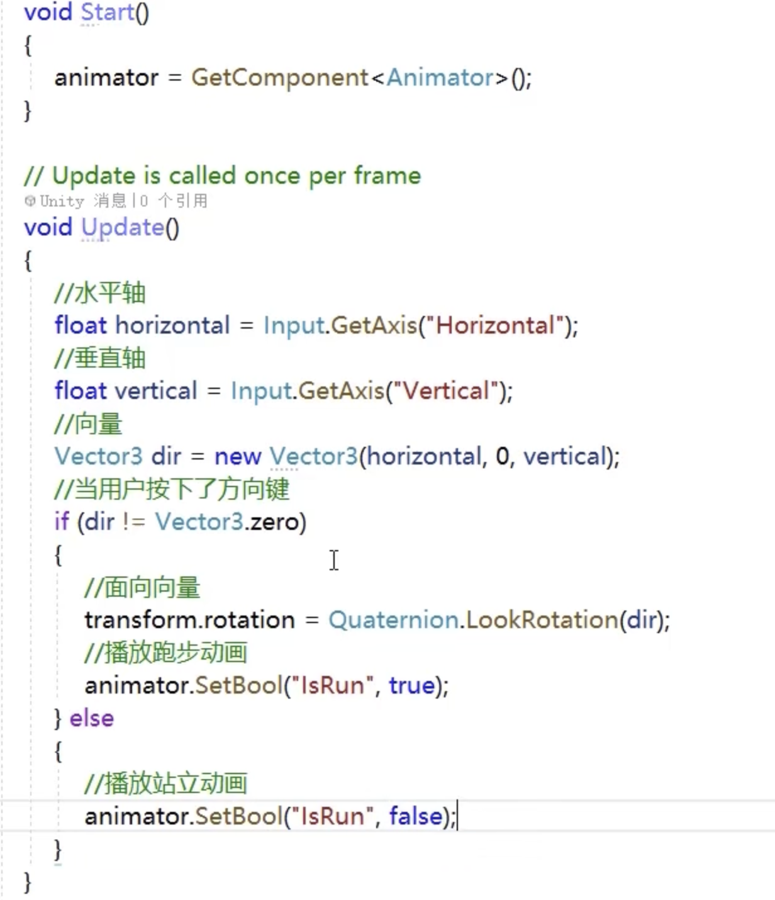
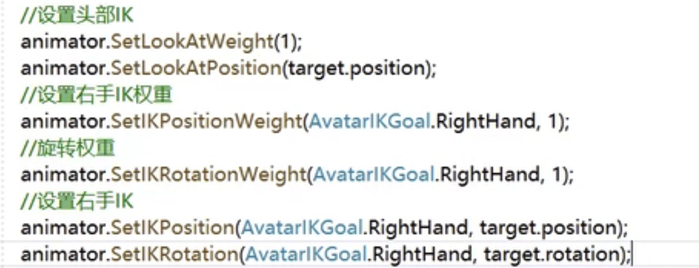
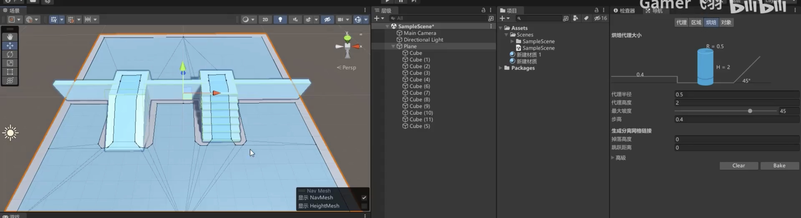
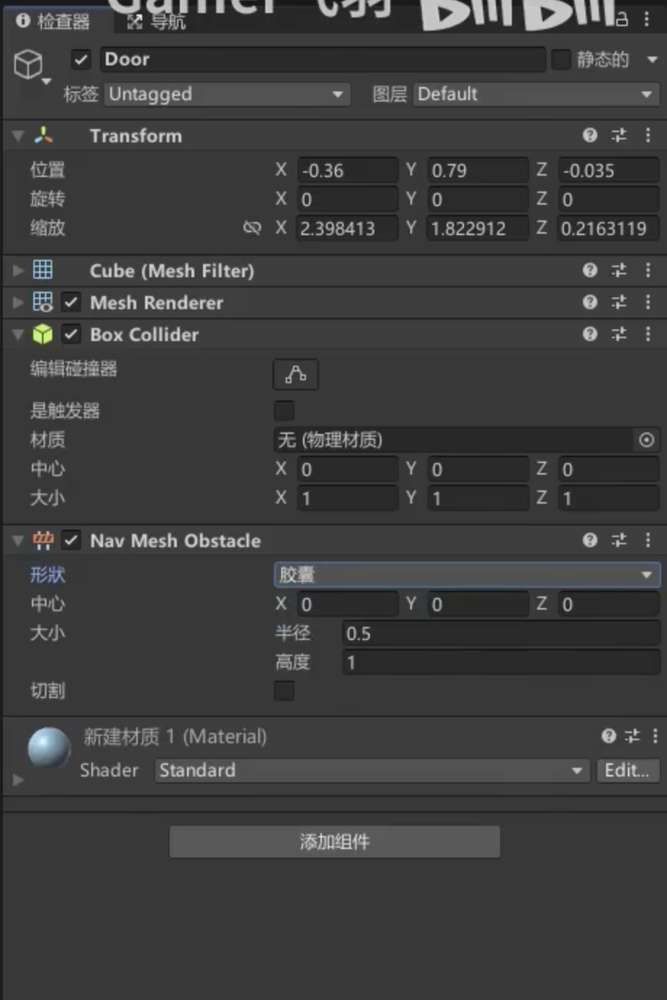

# Vector常用方法

```c#
Debug.Log(Vector3.Angle(v,v2));  //计算两个向量夹角
Debug.Log(Vector3.Distance(v,v2));//计算两个点之间的距离
Debug.Log(Vector3.Dot(v,v2));//点乘
Debug.Log(Vector3.Cross(v,v2));//叉乘
Debug.Log(Vector.Lerp(Vector3.zero,Vector.one,0.5f));//插值
Debug.Log(v.magnitude);//向量的模
Debug.Log(v.nomalized);//规范化向量

//旋转：欧拉角，四元数

Vector3 rotate =new Vector3(0,30,0);
Quaternion quaternion= Quaternion.identity;
//欧拉角转化成四元数
quaternion=Quaternion.Euler(rotate）；
//四元数转化为欧拉角
v = quaternion.eulerAngles;
//看向一个物体
quaternion = Quaternion.LookRotation(Vector3.zero);               


```

# Debug

```
Debug.Log("text");
Debug.LogWarning("text2"); //警告
Debug.LogError("text");    //错误输出
Debug.DrawLine(Vector3.zero,Vector.one,Color.bule); //划线（调试方法） 起点 终点 颜色
Debug.DrawRay(Vector3.zero,Vector3.up,Color.red);	//起点，射线，颜色


```


#  GameObject类物体移动

```
//拿到当前脚本所挂载的游戏物体

//GameObject go =this.gameObject; 
//名称
Debug.Log(gameObject.name); 
//tag
Debug.Log(gameObject.tag); 
//layer
Debug.Log(gameObject.layer); 
//立方体的名称

Debug.Log(Cube.name); 
//当前真正的激活状态

Debug.Log(Cube.activelnHierarchy); 
//当前自身激活状态

Debug.Log(Cube.activeSelf); 
```

# 拿到预设体实例化游戏物体

```c#
BoxCollider bc =GetComponent<BoxCollider>()); 
//获取当前物体的子物体身上的某个组件
//GetComponentInChildren<CapsuleCollider>(bc); 
//获取当前物体的父物体身上的某个组件
//GetComponentlnParent<BoxCollider>0); 
//添加一个组件
Cube.AddComponent<AudioSource>0);
//通过游戏物体的名称来获取游戏物体
GameObject test =GameObject.Find("Test");
//通过游戏标签来获取游戏物体
test = GameObject.FindWithTag("Enemy"); 
test.SetActive(false);
Debug.Log(test.name); 


GameObject go=instantiate(预设体名称); //创造实例
GameObject go= Instantiate(prefab,Vector3.one,Quaternion.identity);
Destroy(go);//销毁
```


# 游戏时间使用

```c#
Debug.Log(Time.time); //游戏开始到现在的时间
Debug.Log(Time.timeScale) //时间缩放值
Debug.Log(Time.fixdDeltaTime);//固定时间间隔
Debug.Log(Time.deltaTime);//上一帧到这一帧所用的时间

```

# Application类

```c#
//游戏数据文件夹路径（只读，加密压缩）

Debug.Log（Application.dataPath＋＂／新建文本文档.txt＂）； 
//持久化文件夹路径
Debug.Log(Application.persistentDataPath); 
//StreamingAssets文件夹路径（只读，配置文件） Debug.Log(Application.streamingAssetsPath); 
//临时文件夹
Debug.Log(Application.temporaryCachePath);
//控制是否在后台运行
Debug.Log(Application.runlnBackground); 
//打开url
Application.OpenURL(""); 
//退出游戏
Application.Quit();

```

# 场景类，场景管理类 SceneManger

```c#
//加载场景
SceneManger.LoadScene();
//获取当前场景
Scene scene =SceneManager.GetActiveScene(); 
//场景名称
Debug.Log(scene.name); 
//场景是否已经加载
Debug.Log(scene.isLoaded);
//场景路径
Debug.Log(scene.path); 
//场景索引
Debug.Log(scene.buildlndex);
GameObject[] gos =scene.GetRootGameObjects(); 
Debug.Log(gos.Length);


//场景管理类
Scene newScene =SceneManager.CreateScene("newScene"); 
//已加载场景个数
Debug.Log(SceneManager.sceneCount); 
//卸载场景
SceneManager.UnloadSceneAsync(newScene); 
//加载场景
//Single关闭所有当前加载的场景 并加载一个场景。Additive将场景添加到当前加载的场景。
SceneManager.LoadScene("MyScene",LoadSceneMode.Additive); 

```

# 异步加载场景

```c#
//协程方法
public class AsyncTest:MonoBehaviour
{
	AsyncOperation operation;
	void Start(){
    StartCoroutine(loadScene());
	} 
//协程方法用来异步加载场景1个引用
	IEnumerator loadScene() {
	operation =SceneManager.LoadSceneAsync(1); 
    //加载完场景不要自动跳转
	operation.allowSceneActivation =false; 
	yield return operation;
	} 
    void Update(){
	//输出加载进度0—0.9
	Debug.Log(operation.progress); timer += Time.deltaTime; //如果到达5秒，再跳转
	if (timer > 5) {
	operation.allowSceneActivation =true;
	}
    }
}
```

# Transform位置 旋转 缩放 父子组件控制

```c#
//获取位置
Debug.Log(transform.position); Debug.Log(transform.localPosition); 
//获取旋转
Debug.Log(transform.rotation); Debug.Log(transform.localRotation); Debug.Log(transform.eulerAngles); Debug.Log(transform.localEulerAngles); 
//获取缩放
Debug.Log(transform.localScale); 
//向量
Debug.Log(transform.forward); Debug.Log(transform.right); Debug.Log(transform.up);


//时时刻刻看向000点
transform.LookAt(Vector3.zero); 
//旋转
transform.Rotate(Vector3.up, 1); 
//绕某个物体旋转
transform.RotateAround(Vector3.zero, Vector3.up, 5); //移动
transform.Translate(Vector3.forward* 0.1f); 


//父子关系
//获取父物体
transform.parent.gameObject 
//子物体个数
Debug.Log(transform.childCount); 
//解除与子物体的父子关系
transform.DetachChildren(); 
//获取子物体
Transform trans = transform.Find("Child"); 
trans =transform.GetChild(0);
判断一个物体是不是另外一个物体的子物体
bool res= trans.lsChildOf(transform); Debug.Log(res);
//设置为父物体
trans.SetParent(transform); 

```

# 键鼠操作（在update中写）

```c#
//鼠标的点击
//按下鼠标 0左键 1右键 2滚轮
if (Input.GetMouseButtonDown(0)) {
Debug.Log("按下了鼠标左键");
}
//持续按下鼠标
if (Input.GetMouseButton(0))
Debug.Log("持续按下鼠标左键”);
//抬起鼠标
if (Input.GetMouseButtonUp(0)) (
Debug.Log("抬起了鼠标左键");
//按下键盘按键
if (Input.GetKeyDown(KeyCode.A))
{
Debug.Log(“按下了A");
}
//持续按下按键
if (Input.GetKey(KeyCode.A))
{
Debug.Log("持续按下A");
1抬起键盘按键
if (Input.GetKeyUp("a"))
{
Debug.Log("松开了A");
}
```

# 虚拟轴	

```c#
//获取水平轴
float horizontal = Input.GetAxis("Horizontal");
float vertical = Input.GetAxis("Vertical");
Debug.Log(horizontal +"  " + vertical):
//虚拟按键
if (Input.GetButtonDown("Jump"))
Debug.Log("空格");
if (Input.GetButton("Jump")
Debug.Log("空格");
if (Input.GetButtonUp("Jump"))
Debug.Loq("空格");
```

# 触摸板

```c#
//开启多点触摸
input.multiTouchEnabled =true;
//判断单点触摸
if(Input.touchCount==1)
{
//触摸对象
Touchtouch=Input.touches[0];
1/触摸位置
Debug.Log(touch.position);
//触摸阶段
switch(touch.phase)
{
caseTouchPhase.Began:
break;
caseTouchPhase.Moved:
break;
caseTouchPhase.Stationary:
break;
caseTouchPhase.Ended:
break;
caseTouchPhase.Canceled:
break
}
  
  //判断多点触摸
if(Input.touchCount==2)
Touchtouch=input.touches[0];
Touchtouch1=Input.touches[1];
```

# 声音

1. 组件名称audio source

```c#
//AudioClip
//音频
public AudioClip music;
//音效
public AudioClip se;
//播放器组件
private AudioSource player;
//Startiscalledbeforethefirstframeupdate
void Start(){
player=GetComponent<AudioSource>();
//设定播放的音频片段
player.clip=music;
//循环
player.loop=true;
//音量
player.volume=0.5f;
//播放
player.Play();
}

//按空格切换声音的播放和暂停
if(Input.GetKeyDown(KeyCode.Space))
{
//如果当前正在播放声音
if(player.isPlaying)
{
//暂停
player.Pause();
  //停止播放进度条从零开始
//player.Stop();
}
  else
{
		//继续
		player.UnPause();
    //开始播放
    player.Play();
}
}


//按鼠标左键播放音效
if(input.GetMouseButton(0)){
  Player.PlayOneShot(se);
}
```

# 视频播放脚本

```c#
using UnityEngine.video;


play= GetComponent<VideoPlayer>();


```

# 角色控制

1. 商店中的角色控制器
2. unity自带的角色控制器
3. 自己编写角色控制器

组件Charater controller

## 脚本

```c#
private CharaterController player;

//水平轴
floathorizontal=Input.GetAxis("Horizontal");
//垂直轴
floatvertical=Input.GetAxis("Vertical");
//创建成一个方向向量
Vector dir=new Vector3(horizontal,0,vertical);
//Debug.DrawRay(transform.position,dir,Color.red);
//朝向该方向移动
player.SimpleMove(dir);
```

# 碰撞监听

```c#
public GameObject Prefab;

//监听发生碰撞
private void OnCollisionEnter(Collision collision)
{
	//创建一个爆炸物体
	Instantiate(Prefab,transform.position,Quaternion.identity);
	//销毁自身
	Destroy(gameObject);I
    //获取碰撞到的物体
	Debug.Log(collision.gameObject.name);
}
//持续碰撞中
private void OnCollisionStay(Collision collision)
{
}
//结束碰撞
private void OnCollisionExit(Collision colision){
  
}
```

# 触发监听

```c#
private void OnTriggerEnter(Collider other)
{
GameObject door=GameObject.Find("Door");
if(door!=null)
{door.SetActive(false);
}

private void OnTriggerStay(Collider other){
  
}
private void OnTriggerExit(Collider other）{
}
```

# 弹簧铰链特殊关节

添加组件：Hinge Joint（铰链关节）

​					Spring Joint(弹簧组件)

​					Fixed Joint (固定组件)

# 物理材质


# 射线检测

```c#
if(Input.GetMouseButtonDown(0))
{
//按下鼠标左键发射射线
Rayray=Camera.main.ScreenPointToRay(Input.mousePosition)
//声明一个碰撞信息类
RaycastHit hit;
//碰撞检测
bool res=Physics.Raycast(ray,out hit);
//如果碰撞到的情况下，hit就有内容了
if(res==true)
{
Debug.Log(hit.point);
transform.position=hit.point;
}
//多检测
RaycastHit[] hits=Physics.RaycastAll(ray,100,1<<10);
```

# 为游戏物体添加动画


ctrl+6 动画面板


新版animator组件

自己创建动画控制器 CubeController

拖动到animator控制器组件中


编写脚本：按下鼠标左键切换动画


免费动画资源包 ： character pack:Free Sample


playercontrol


给动画设置扳机（当前动画播放完了才播放下一个动画，除非把有退出时间的钩取消）


# 按键控制人物移动

控制人物旋转


控制人物动作切换和旋转



移动


# 曲线和帧事件的使用


事件


事件调用的方法写在这个对象上的任何一个脚本组件都可以

# 混合动画


# 动画分层


any state：任何状态

entry： 入口状态

exit：   出口状态


设置多个图层设置权重

# 遮罩


选择手臂 分层 可以让身体不同区域播放不同动画


# 反向动力学

动画器中IK处理打开


绑定球体


SetLookAtWeight(1)设置权重





这段代码作用：让头部和右手指向target，并且旋转


# 导航组件

窗口->AI->导航



烘焙


## 导航动起来吧


为游戏内的物体添加导航组件

编写playercontrol脚本

```c#
private NavMeshAgent agent;
void Start()
{
//获取代理组件
agent GetComponent<NavMeshAgent>();
}
void Update()
{//如果按下鼠标
if (Input.GetMouseButtonDown(0))
{
//获取点击位置
Ray ray =Camera.main.ScreenPointToRay(Input.mousePosition);
RaycastHit hit;
if (Physics.Raycast(ray,out hit))
{
//点击位置
Vector3 point hit.point;
//设置该位置为导航目标点
agent.SetDestination(point);
}
}
}

```


## 网格链接与动态障碍物

为动态障碍物添加组件



切割：动态的重新烘焙


### 生成分离网格链接


生成网格链接打开 才能支持


### off Mesh Link组件


两个点来网格链接


## 导航区域


# UI绘制

创界画布Canvas 自动创建EventSystem(事件系统)

Fantasy Free GUI 免费UI资源


## 编写UI脚本


## 选项组件与切换，下拉框

选项组件： Toggle

滑动条： Silder

滚动视图：Scroll View

## 创建UI面板


panel面板：将UI界面写入Panel可以防止弄乱

## UI常用组件

mask：遮罩

Content Size Fitter:自动匹配TEXT大小 宽高自动缩放

Vertical Layout Group  horizontical Layout Group：垂直水平布局组

Grid Layout Group：网格式图组


